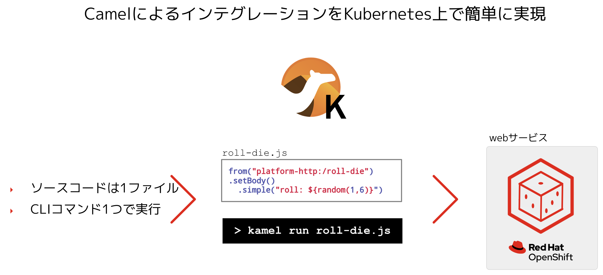
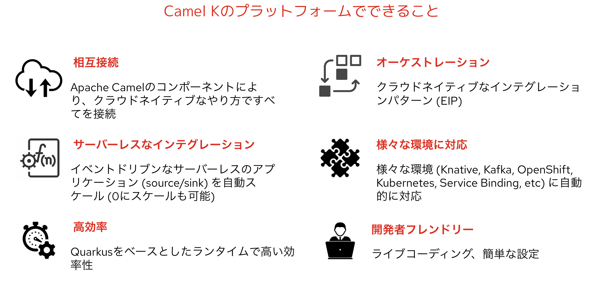
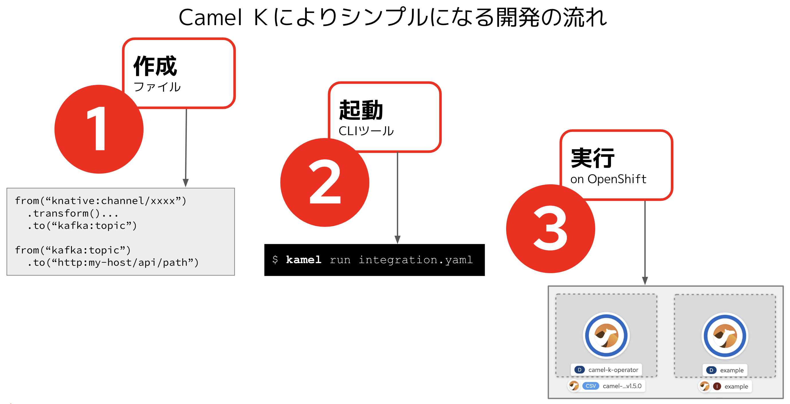

## Camel K について
---

### Camel K 概要

Red Hat Integration - Camel K は、OpenShift のクラウドでネイティブで実行される Apache Camel K からビルドされる軽量のインテグレーションフレームワークです。Camel K は、サーバーレスおよびマイクロサービスアーキテクチャー向けに特別に設計されています。Camel K を使用すると、Camel Domain Specific Language (DSL) で書かれたインテグレーションコードを直接 OpenShift で即座に実行することができます。[Camel K](https://github.com/apache/camel-k) は Apache Camel オープンソースコミュニティーのサブプロジェクトです。

* OpenShiftとKubernetes上でインテグレーションをサーバーレスで動作させることが可能なプラットフォーム
* KubernetesのCRDとオペレータの仕組みをベース
* コミュニティーベースのプロジェクト
* Apache Camelのサブプロジェクトとして、2018/8/31にスタート

{:width="800px"}

### Camel K の特徴

* Kubernetes/OpenShift上で直接インテグレーションを実行
* ランタイムとしてQuarkusを使用可能
* Knativeが利用可能な環境ではサーバーレスで実行可能
* Kubernetesのオペレーターをベース
* Camelの依存関係は自動的に処理
* デプロイ前のDockerやS2Iの設定が不要

### Camel K のプラットフォームでできること

{:width="800px"}

{:width="800px"}

#### 参考リンク

* [Camel K のスタートガイド](https://access.redhat.com/documentation/ja-jp/red_hat_integration/2022.q4/html/getting_started_with_camel_k/introduction-to-camel-k) ※RED HAT INTEGRATION 2022.Q4 の製品ドキュメント
* [Apache Camel K](https://camel.apache.org/camel-k/) ※コミュニティのページ