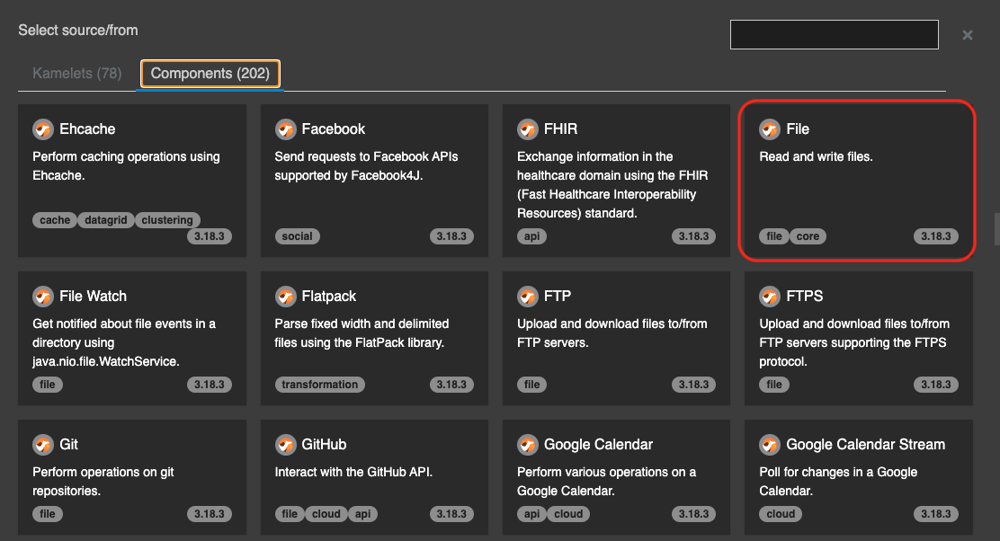
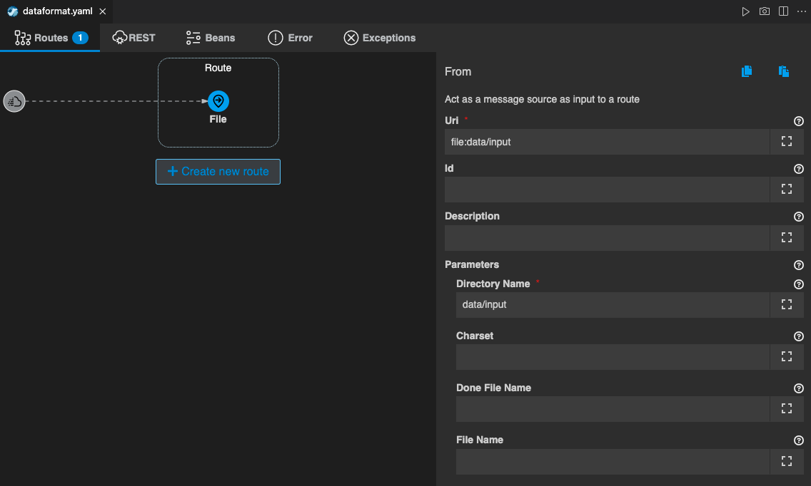

## Data Formats パターン


### 1. 目的

[DataFormat](https://camel.apache.org/components/{{ CAMEL_VERSION }}/dataformats/index.html) を使用して、Camel K のデータ変換機能の使用方法を理解する事を目的とします。

### 2. CSVファイルをJSON形式に変換する

VSCODE 左のエクスプローラー上で、右クリックをして、メニューから `Karavan: Create Integration` を選択し、任意のファイル名で空のインテグレーションを作成をしてください。
（ここでは、DataFormat というファイル名にしておきます。）

まず、CSVファイルを取得する処理を作成します。

`DataFormat.yaml` の Karavan Designer のGUIを開き、上部の `Create new route` をクリックして、Route を作成しましょう。

`components` タブから `File` を探して選択をしてください。
右上のテキストボックスに `File` と入力をすると、絞り込みができます。


{:width="600px"}

Route の source として、File コンポーネントが配置されます。
Route の File シンボルをクリックすると、右側にプロパティが表示されますので、確認してください。

Parameters は、以下を入力してください。

* **Directory Name**: data/input

> 前章の [Fileコンポーネント]({{ HOSTNAME_SUFFIX }}/workshop/camel-k/lab/file-component) で `data/input` フォルダを作成していない場合は、フォルダを作成してください。


{:width="800px"}

最後に、テスト用のCSVファイルを作成します。
左のエクスプローラー上で、右クリックをして、メニューから `新しいファイル` を選択し、`test.csv` を作成します。

ファイルの中身は、

```
id, name
1, apple
2, orange
3, lemon
```

としてください。