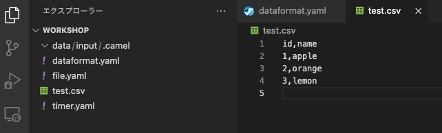
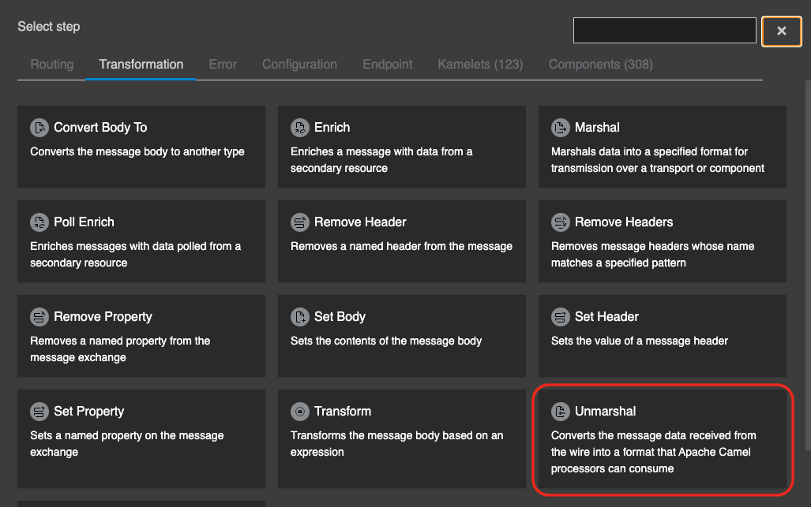
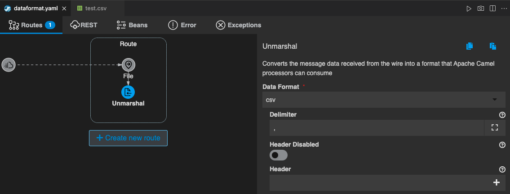

## Data Formats パターン


### 1. 目的

[Marshal](https://camel.apache.org/components/{{ CAMEL_VERSION }}/eips/marshal-eip.html) と [Unmarshal](https://camel.apache.org/components/{{ CAMEL_VERSION }}/eips/unmarshal-eip.html#) を使用して、Camel K のデータ変換機能の使用方法を理解する事を目的とします。

* **Marshal** - Message の Body の Javaオブジェクト等をバイナリやテキスト形式に変換します。
* **Unmarshal** - Message の Body の バイナリやテキスト形式のデータをJavaオブジェクトに変換します。

Apache Camel が提供する Data Format については[こちら](https://camel.apache.org/components/{{ CAMEL_VERSION }}/dataformats/index.html)を参照してください。

### 2. CSVファイルをJSON形式に変換する

VSCODE 左のエクスプローラー上で、右クリックをして、メニューから `Karavan: Create Integration` を選択し、任意のファイル名で空のインテグレーションを作成をしてください。
（ここでは、DataFormat というファイル名にしておきます。）

まず、CSVファイルを取得する処理を作成します。

`DataFormat.yaml` の Karavan Designer のGUIを開き、上部の `Create new route` をクリックして、Route を作成しましょう。

`components` タブから `File` を探して選択をしてください。
右上のテキストボックスに `File` と入力をすると、絞り込みができます。


{:width="600px"}

Route の source として、File コンポーネントが配置されます。
Route の File シンボルをクリックすると、右側にプロパティが表示されますので、確認してください。

Parameters は、以下を入力してください。

* **Directory Name**: data/input

> 前章の [Fileコンポーネント]({{ HOSTNAME_SUFFIX }}/workshop/camel-k/lab/file-component) で `data/input` フォルダを作成していない場合は、フォルダを作成してください。


{:width="800px"}

最後に、テスト用のCSVファイルを作成します。
左のエクスプローラー上で、右クリックをして、メニューから `新しいファイル` を選択し、`test.csv` を作成します。

ファイルの中身は、

```
id, name
1, apple
2, orange
3, lemon
```

としてください。


{:width="400px"}

では、取得するファイルの中身を変換していきます。
まず、オブジェクトに変換するために、`Unmarshal` を使用します。

Route にマウスカーソルを持っていくと、File シンボルの下に小さな＋ボタンが現れますので、それをクリックし、`Transformation` のタブから `Unmarshal` を探して選択をしてください。


{:width="600px"}

`Unmarshal` のシンボルが File に続いて配置されます。

Parameters は、以下のように設定をしてください。
他の項目は、デフォルトのままで構いません。

* Data Format: csv
* Delimiter: , (カンマ)
* Use Maps: True


{:width="800px"}

{:width="800px"}