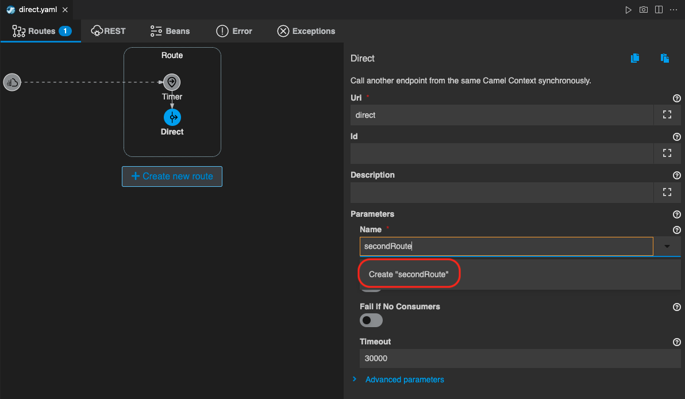

## Direct コンポーネント
---

### 1. 目的

[Direct](https://camel.apache.org/components/{{ CAMEL_VERSION }}/direct-component.html) を使用して、Camel K で Route を分岐する方法を理解することを目的とします。

### 2. Direct を使用して Route を分岐する

左のエクスプローラー上で、右クリックをして、メニューから `Karavan: Create Integration` を選択し、任意のファイル名で空のインテグレーションを作成をしてください。
（ここでは、direct というファイル名にしておきます。）

続いて、Karavan Designer のGUIが開いたら、上部の `Create new route` をクリックして、Route を作成しましょう。

`components` タブから `Timer` を探して選択をしてください。
右上のテキストボックスに `Timer` と入力をすると、絞り込みができます。

{:width="600px"}

Route の source として、Timer コンポーネントが配置されます。
Route の Timer シンボルをクリックすると、右側にプロパティが表示されますので、確認してください。

Parameters は、以下のように設定をします。

* **Timer Name**: 任意の名称
* **Repeat Count**: 1

{:width="800px"}

次に、別の Route を呼び出しするための Direct を追加します。
Route にマウスカーソルを持っていくと、Timer シンボルの下に小さな＋ボタンが現れますので、それをクリックし、`Routing` のタブから `Log` を探して選択をしてください。

`components` タブから `Direct` を探して選択をしてください。
右上のテキストボックスに `Direct` と入力をすると、絞り込みができます。

{:width="600px"}

`Direct` のシンボルが Timer に続いて配置されます。

Direct プロパティ の `Name` に、`secoundRoute` と入力をしてください。
すると入力欄のすぐ下に、`Create "secoundRoute"` と表示されますので、それをクリックします。

{:width="800px"}

scoundRoute が作成されて、source に Direct コンポーネントが配置されます。

{:width="800px"}

それでは、scoundRoute が呼び出されかどうかを確認するための Log を出力しておきます。

scoundRoute の Direct シンボルの下に小さな＋ボタンが現れますので、それをクリックし、`Routing` のタブから `Log` を探して選択をしてください。

Log の Messege は、`scoundRoute invoked` と入力をしておきます。

{:width="800px"}

それでは、実際に動かしてみます。

右上の **▷** の実行ボタンを押してください。
（もしくは、左のエクスプローラでファイル名を右クリックして、`Karavan: Run File` を選択してください）

ターミナルが開き、作成したインテグレーションが JBang を通して実行されます。
特にエラーなく実行されたら、ターミナルの Log を確認してください。

{:width="800px"}

確認後、`Ctrl+C` もしくは、ターミナル右上のゴミ箱のアイコンをクリックして、終了してください。