## File コンポーネント
---

### 1. 目的

[File](https://camel.apache.org/components/{{ CAMEL_VERSION }}/file-component.html) コンポーネントの内容を理解します。

### 2. ファイルの取得・出力を行う

VSCODE 左のエクスプローラー上で、右クリックをして、メニューから `新しいファイル` を選択し、ワークスペースのルートフォルダ直下に、`data` フォルダを作成します。

さらに、data フォルダの配下に、`input`、`output` フォルダを作成します。

次に、左のエクスプローラー上で、右クリックをして、メニューから `Karavan: Create Integration` を選択し、任意のファイル名で空のインテグレーションを作成をしてください。
（ここでは、file というファイル名にしておきます。）

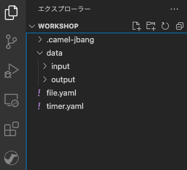
{:width="300px"}

`file.yaml` の Karavan Designer のGUIを開き、上部の `Create new route` をクリックして、Route を作成しましょう。

`components` タブから `File` を探して選択をしてください。
右上のテキストボックスに `File` と入力をすると、絞り込みができます。


{:width="600px"}

Route の source として、File コンポーネントが配置されます。
Route の File シンボルをクリックすると、右側にプロパティが表示されますので、確認してください。

Parameters が色々ありますが、必須項目は `Directory Name` のみです。
今回は、他はそのままで構いません。

* **Directory Name**: data/input

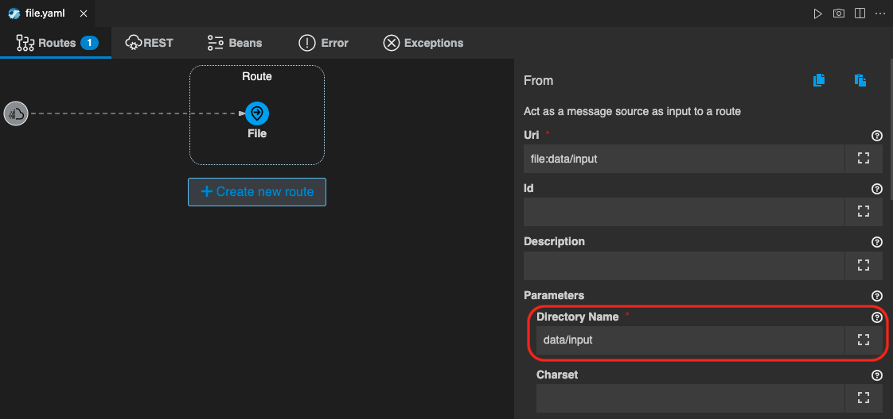
{:width="800px"}

次に、取得したファイルの中身を表示するための Log を追加します。
Route にマウスカーソルを持っていくと、File シンボルの下に小さな＋ボタンが現れますので、それをクリックし、`Routing` のタブから `Log` を探して選択をしてください。

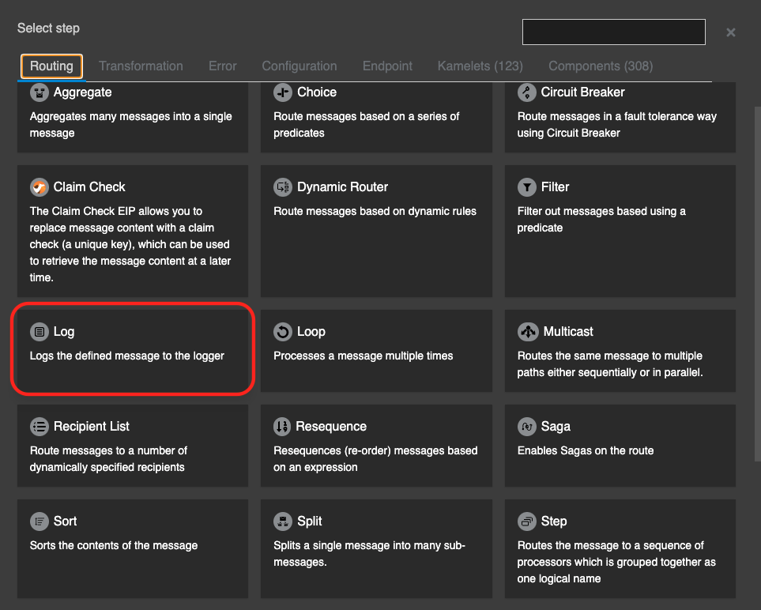
{:width="600px"}

`Log` のシンボルが File に続いて配置されます。

File コンポーネントで取得した内容は、Message の `body` に格納されています。
Log プロパティ の `Message` に `${body}` と入力をしてください。

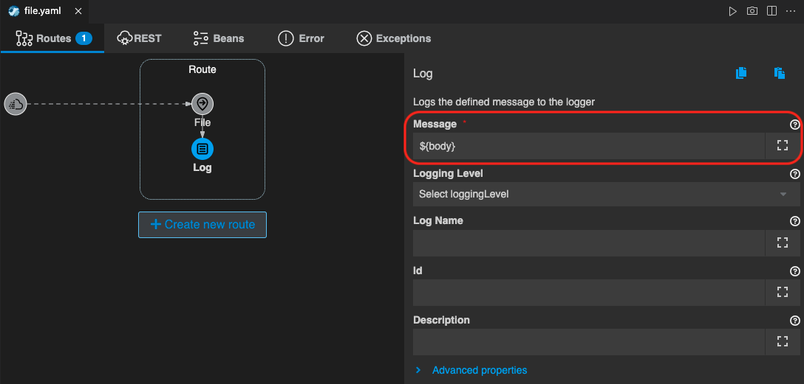
{:width="800px"}

ファイルを出力して格納する処理を作成します。
Log シンボルの下の＋ボタンをクリックして、`components` タブから `File` を探して選択をしてください。

File の プロパティが開きますので、以下を入力します。
他はそのままで構いません。

* **Directory Name**: data/output

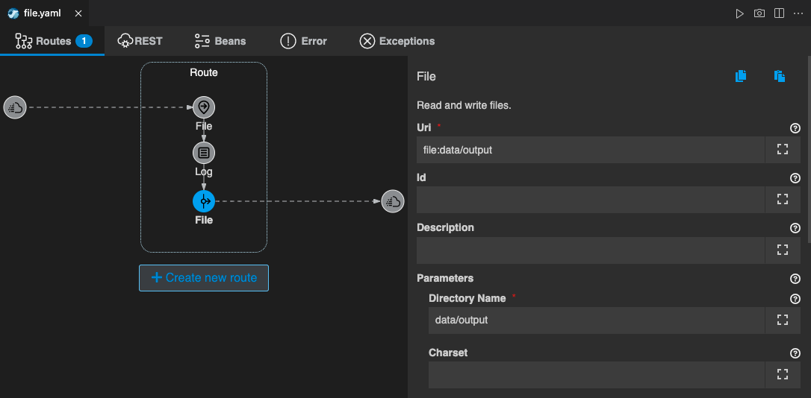
{:width="800px"}

最後に、テスト用のテキストファイルを作成します。
左のエクスプローラー上で、右クリックをして、メニューから `新しいファイル` を選択し、`test.txt` を作成します。

ファイルの中身は、

```
Hello World!
```

としてください。

それでは、実際に動かしてみます。

`file.yaml` をもう一度開き、右上の **▷** の実行ボタンを押してください。
（もしくは、左のエクスプローラでファイル名を右クリックして、`Karavan: Run File` を選択してください）

ターミナルが開き、作成したインテグレーションが JBang を通して実行されます。
特にエラーなく実行されたら、先ほど作成した `test.txt` を `data/input` フォルダに移動して格納をしてください。

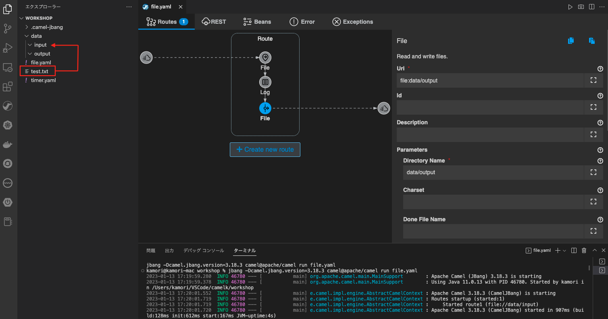
{:width="800px"}

ファイルが所定のフォルダに格納されると、インテグレーションが実行されて、コンソールに Log が表示され、`data/output` にファイルが格納されます。
（インプットのファイルは、`data/input` 配下に `.camel` フォルダが作成され、そちらに移動します）

ファイルが作成されたら、ファイルの中身を確認してください。

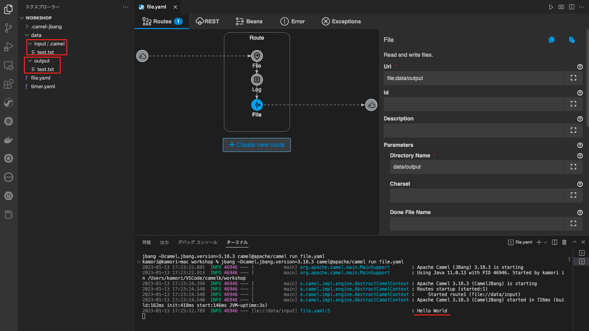
{:width="800px"}

確認後、`Ctrl+C` もしくは、ターミナル右上のゴミ箱のアイコンをクリックして、終了してください。


### 3. ファイルの内容に追記をして出力をする

ここでは、取得したファイルの内容に、追記をして出力する処理を、先ほど作成したインテグレーションに追加をしていきます。

もう一度、`file.yaml` の Karavan Designer のGUIを開きます。

Route の 出力側の File シンボルにマウスカーソルを持っていくと、左上に小さく `→` ボタンが表示されますので、クリックします。

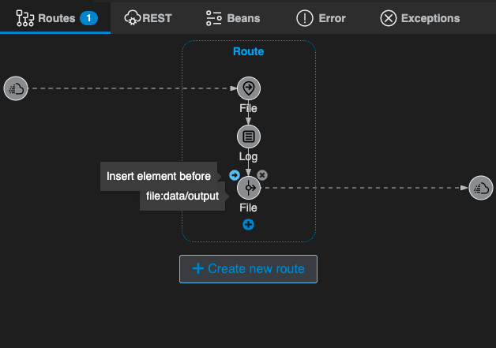
{:width="400px"}

続いて、`Transformation` タブから `Set Body` を探して選択をしてください。
右上のテキストボックスに `Set Body` と入力をすると、絞り込みができます。

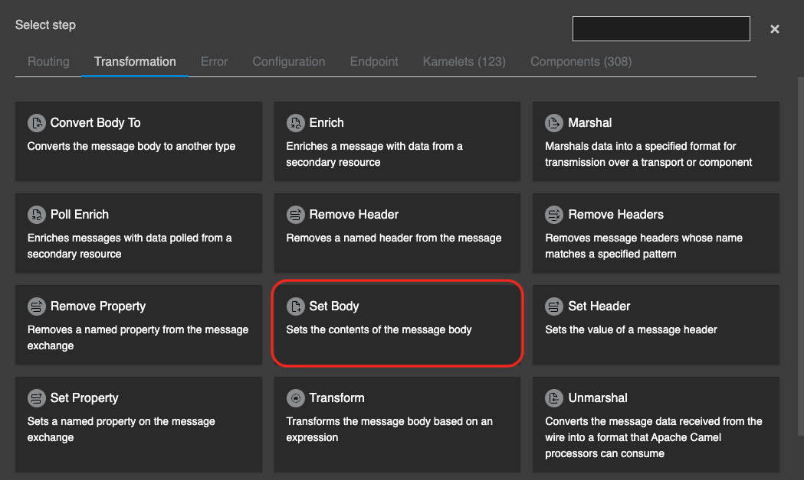
{:width="600px"}

これで、`Log` と `File` の間に、`Set Body` が追加されました。

`Set Body` のシンボルをクリックすると、右側にプロパティが表示されますので、
Parameters 項目に、以下の内容を設定してください。

 * **Language**: simple ([simple](https://camel.apache.org/components/{{ CAMEL_VERSION }}/languages/simple-language.html) についての詳細はこちらを参照ください)
 * **Expression**: 

```
${body}

It's ${date:now:HH:mm:ss} now.
```

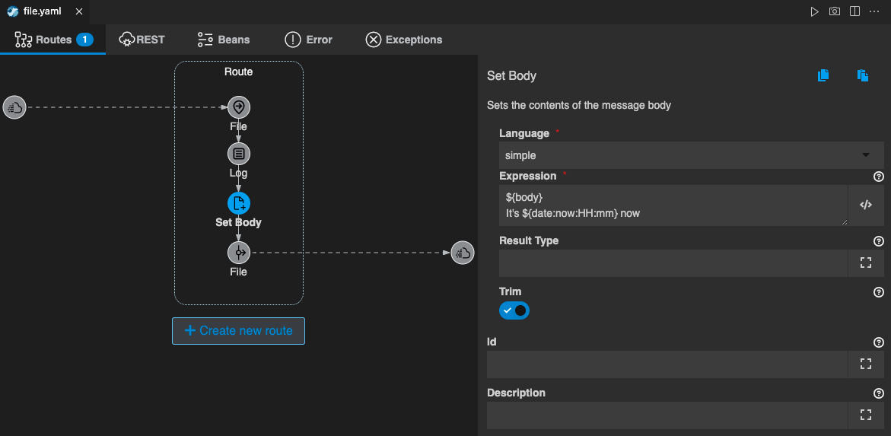
{:width="800px"}

再び、`file.yaml` を開き、右上の **▷** の実行ボタンを押してください。
（もしくは、左のエクスプローラでファイル名を右クリックして、`Karavan: Run File` を選択してください）

ターミナルが開き、作成したインテグレーションが JBang を通して実行されます。
特にエラーなく実行されたら、もう一度、 `test.txt` を `data/input` フォルダに移動して格納をしてください。

ファイルが所定のフォルダに格納されると、インテグレーションが実行されて、コンソールに Log が表示され、`data/output` にファイルが格納されます。
（インプットのファイルは、`data/input` 配下に `.camel` フォルダが作成され、そちらに移動します）

ファイルが作成されたら、`data/input/.camel`、`data/output` の両フォルダのファイルの中身を確認してください。
`data/output` に格納されたファイルには、現在時刻が `Set Body` で追記されて出力されています。

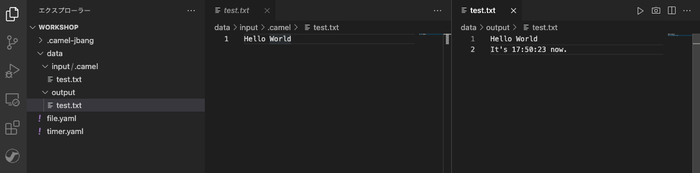
{:width="800px"}

確認後、`Ctrl+C` もしくは、ターミナル右上のゴミ箱のアイコンをクリックして、終了してください。