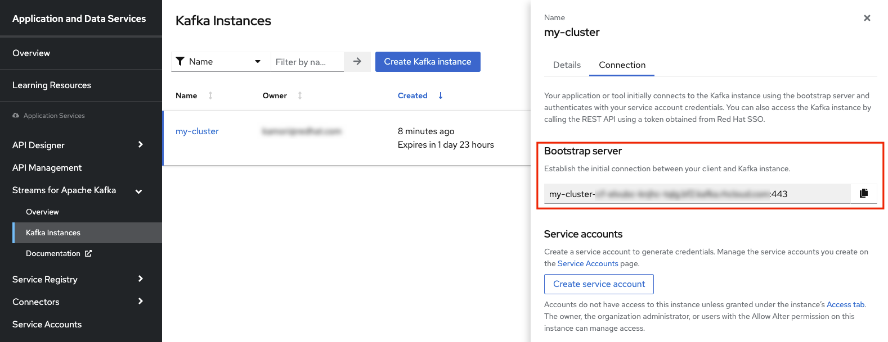
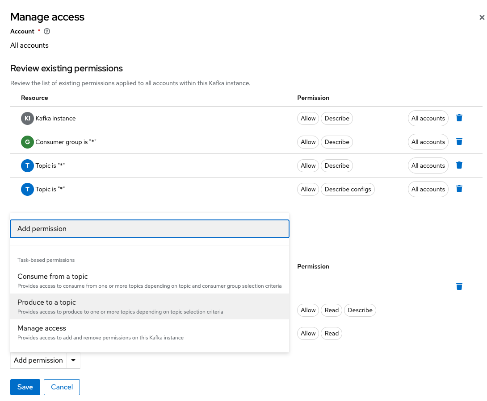
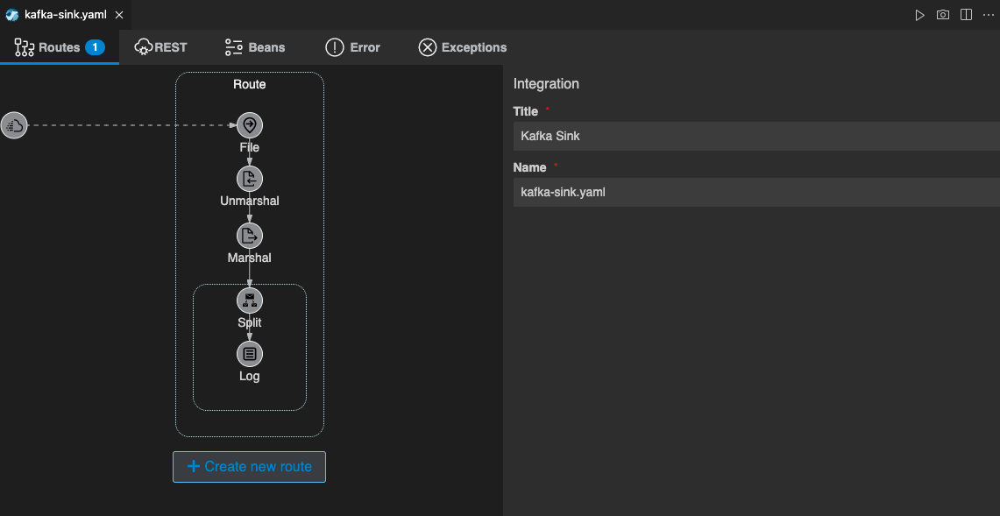
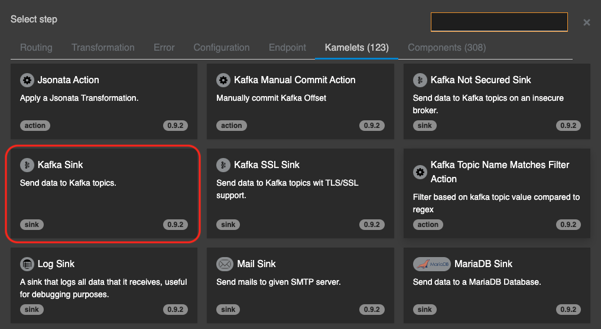
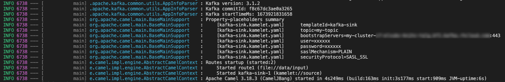
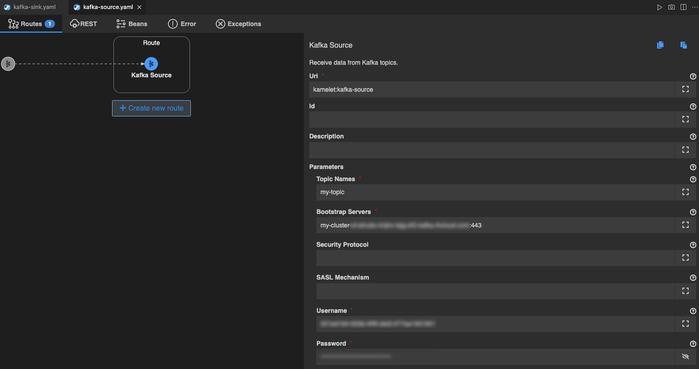

## Kafka との連携
---

### 1. 目的

Kamelet の **Kafka Sink**, **Kafka Source** を使用して、Camel K と Kafka との連携の方法について理解していただきます。

* [Kafka Sink](https://camel.apache.org/camel-kamelets/{{ KAMELETS_VERSION }}/kafka-sink.html)
* [Kafka Source](https://camel.apache.org/camel-kamelets/{{ KAMELETS_VERSION }}/kafka-source.html)

### 2. Red Hat OpenShift Streams for Apache Kafka　(RHOSAK) の準備

この章では、Red Hat が提供するマネージド kafka のサービスである、Red Hat OpenShift Streams for Apache Kafka (略してRHOSAK) を使用していきます。
RHOSAK を使用すると、Kafkaの環境を自分で構築・運用することなく、ストリーム処理のアプリケーションの開発やリリースを簡単に行うことができるようになります。
なお、2023年1月現在、RHOSAKは48時間有効の、無料のトライアル版を使用することができます。

#### 2.1 RHOSAK で Kafka インスタンスをプロビジョニングする

[console.redhat.com](https://console.redhat.com/) にアクセスし、Red Hat アカウントでログインします。

もし Red Hat アカウントを持っていない場合は、Register for a Red Hat accountリンクをクリックして、Red Hat アカウントを作成してください。
その際は、`Account Type: Personal` を選択してください。

{:width="300px"}

ログインすると、左のメニューから、`Application and Data Services` -> `Streams for Apache Kafka` -> `Kafka Instance` を選択します。

{:width="800px"}

Kafka Instances のページで、`[Create Kafka instance]` をクリックします。

{:width="600px"}

Create a Kafka instance のページに移動するので、`Name` に任意のクラスターの名前を入力してください。

他の項目はこのままで、一番下にスクロールして `[Create instance]` をクリックします。

{:width="800px"}

作成した Kafka インスタンスがリストに表示されます。しばらくすると、インスタンスの Status が `Ready` になるので待ちましょう。

インスタンスの Status が `Ready` になったら、右側の３点のアイコンから、`Detail` を選択してください。

{:width="800px"}

作成したインスタンスの詳細が表示されますので、`Connection` タブをクリックして、`Bootstrap server` の内容をメモしておきます。

{:width="800px"}

#### 2.2 RHOSAK で Kafka インスタンスに接続するための Service Account を作成する

アプリケーションまたはサービスを RHOSAK の Kafka インスタンスに接続するには、Service Account を作成する必要があります。

先ほどの Kafka インスタンス詳細ページの、Bootstrap server の下に、`[Create service account]` があるので、クリックして選択してください。もしくは、左側のメニューから `Service Accounts` -> `[Create service account]` でもOKです。

任意のアカウント名を入力して、`[Create]` を選択します。

{:width="800px"}

作成した Service Account の ID と Secret が表示されますので、メモをしてから閉じてください。

<pre>
（※注）
生成された資格情報は1回だけ表示されるため、資格情報のウィンドウを閉じる前に、コピーした資格情報が正常かつ安全に保存されていることを確認してください。
</pre>

{:width="800px"}

#### 2.3 RHOSAK で Service Account の権限を変更する

Kafka インスタンスに接続するための Service Account を作成した後、Kafka インスタンスのアクセス制御リスト (ACL) で、その Service Account に適切なアクセスレベルを設定する必要があります。

左側メニューから `Kafka Instances` を選択し、先ほど作成したインスタンスの名前をクリックします。

{:width="800px"}

`Access` タブを選択し、`[Manage Access]` を選択します。

{:width="800px"}

ポップアップ画面が開いたら、ドロップダウンのメニューから `All accounts` をクリックします。

{:width="800px"}

次に、`Add permissions` のドロップダウンのメニューから、`Consume from a topic` を選択してください。

{:width="800px"}

`Topic` と `Consumer group` の権限について、左の欄は `is`、 右の欄に `* (アスタリスク)` を入力します。 

{:width="800px"}

さらに、`Add permissions` のドロップダウンのメニューから、今度は `Produce to a topic` を選択します。

{:width="800px"}

`Topic` の権限について、左の欄は `is`、 右の欄に `* (アスタリスク)` を入力します。 

最後に、`[Save]` を選択してください。

{:width="800px"}

これで、アプリケーションやサービスからトピックにアクセスする準備ができました。

{:width="800px"}

#### 2.4 RHOSAK で Kafka トピック を作成する

Kafka インスタンスと Service Account を作成したら、Kafka トピックを作成して、アプリケーションやサービスで Kafka メッセージの取得や送信ができます。

作成した kafka インスタンス の `Topic` タブを選択し、`[Create topic]` を選択します。

{:width="800px"}

ガイドの手順に従って、トピックの詳細を定義していきます。
任意のトピック名を入力し、`Next` を選択してください。

{:width="800px"}

* **Topic name**: 任意のトピック名を入力します。
* **Partitions**: このトピックのパーティション数を設定します。パーティションは、トピック内のメッセージの個別のリストで、トピックの一部をクラスター内の複数のブローカーに分散させることができます。トピックには1つまたは複数のパーティションを含めることができ、プロデューサーとコンシューマーの負荷をスケーリングできます。
* **Message retention**: メッセージの保存期間とサイズを適切な値に設定します。既定の保持時間は `A Week` 、保持サイズは `Unlimited` に設定されています。メッセージ保持時間は、クリーンアップポリシーに応じて、削除または圧縮される前にトピックに保持されている期間です。保持サイズとは、パーティション内のすべてのログセグメントが削除または圧縮されるまでの最大合計サイズです。
* **Replicas**: RHOSAK の本リリースでは、レプリカは事前に設定されています。1つのブローカーのみで構成されるトライアル版のKafkaインスタンスでは、トピックのパーティションレプリカの数と、パーティションリーダーと同期する必要があるフォロワーレプリカの最小数が1に設定されています。レプリカは、トピック内のパーティションのコピーです。パーティション・レプリカは、クラスター内の複数のブローカーに分散され、ブローカーに障害が発生した場合にトピックの可用性を確保します。フォロワーレプリカがパーティションリーダーと同期している場合、フォロワーレプリカは必要に応じて新しいパーティションリーダーになることができます。

他の項目は一旦そのままで良いので、`Next` を選択し、最後に `Finish` を選択してください。
トピックの設定が完了すると、新しい Kafka トピックが一覧に表示されます。

{:width="800px"}

### 3. Kafka Sink を使用して、Kafka トピックにメッセージを送信する

少し長くなりましたが、RHOSAK で Kafka を使用する準備ができましたので、まずは Kafka にメッセージを送信する処理を作成していきます。

ここでは、[Split パターン]({{ HOSTNAME_SUFFIX }}/workshop/camel-k/lab/split-eip)で作成したインテグレーションに、Kafkaトピックへのメッセージの送信処理を追加していきます。
まだ [Split パターン]({{ HOSTNAME_SUFFIX }}/workshop/camel-k/lab/split-eip) を実施していない場合は、そちらを先に実施してください。

VSCODE に戻り、左のエクスプローラー上で、`split.yam` を複製し、任意のファイル名に変更してください。（ここでは、kafka-sink.yaml としておきます）

{:width="800px"}

それでは、Kafka トピックにメッセージを送信する処理を追加していきます。
Log シンボルにマウスカーソルを持っていくと、左上に小さく `→` ボタンが表示されますので、クリックします。

続いて、`Kamelets` タブから `Kafka Sink` を探して選択をしてください。
右上のテキストボックスに `Kafka Sink` と入力をすると、絞り込みができます。

{:width="600px"}

これで、`Split` と `Log` の間に、`Kafka Sink` が追加されました。

`Kafka Sink` のシンボルをクリックすると、右側にプロパティが表示されますので、
Parameters 項目に、以下の内容を設定してください。
他の項目は、デフォルトのままで構いません。

* **Topic Names**: RHOSAK で作成した Kafka トピック名
* **Bootstrap Servers**: RHOSAK で作成した Kafka インスタンスの Bootstrap Servers
* **Username**: Service Account の ID
* **Password**: Service Account の Secret

{:width="800px"}

最後に、テスト用のCSVファイルを用意します。
[DataFormatsパターン]({{ HOSTNAME_SUFFIX }}/workshop/camel-k/lab/data-formats) の章で作成した `test.csv` を使用します。
ファイルが無い場合は、左のエクスプローラー上で、右クリックをして、メニューから `新しいファイル` を選択し、`test.csv` を作成します。

ファイルの中身は、

<pre>
  id,name
  1,apple
  2,orange
  3,lemon
</pre>

としてください。

それでは、実際に動かしてみます。

右上の **▷** の実行ボタンを押してください。
（もしくは、左のエクスプローラでファイル名を右クリックして、`Karavan: Run File` を選択してください）

ターミナルが開き、作成したインテグレーションが JBang を通して実行されます。
Kafka に接続ができていれば、ターミナルに以下の様に表示されているはずです。

{:width="800px"}

特にエラーなく実行されたら、`test.csv` を `data/input` フォルダに移動して格納をしてください。
ファイル格納後、以下の様な Log が表示されていればOKです。

{:width="800px"}

では、実際に送信されているかどうかを確認してみましょう。
[RHOSAK](https://console.redhat.com/application-services/streams/kafkas) に戻り、作成した Kafka インスタンスのページを開きます。

`Topics` のタブを選択し、作成したトピック名をクリックしてください。

{:width="800px"}

次に、トピックの詳細ページで `Messages` のタブを選択すると、送信したメッセージが確認できます。

{:width="800px"}

メッセージの確認ができたら、処理を停止してください。

### 4. Kafka Source を使用して、Kafka トピックからメッセージを受信する

今度は、まずは Kafka からメッセージを受信する処理を作成していきます。 

VSCODE 左のエクスプローラー上で、右クリックをして、メニューから `Karavan: Create Integration` を選択し、任意のファイル名で空のインテグレーションを作成をしてください。
（ここでは、kafka-source というファイル名にしておきます。）

Karavan Designer のGUIをが開いたら、上部の `Create new route` をクリックして、Route を作成しましょう。

`Kamelets` タブから `Kafka Source` を探して選択をしてください。
右上のテキストボックスに `Kafka Source` と入力をすると、絞り込みができます。

{:width="600px"}

Route の source として、Kafka Source コンポーネントが配置されます。
Kafka Source シンボルをクリックすると、右側にプロパティが表示されますので、確認してください。

Parameters は、以下を入力してください。

* **Topic Names**: RHOSAK で作成した Kafka トピック名
* **Bootstrap Servers**: RHOSAK で作成した Kafka インスタンスの Bootstrap Servers
* **Username**: Service Account の ID
* **Password**: Service Account の Secret
* **Auto Offset Reset**: earliest
  * `earliest`: 最初のoffsetに自動リセット
  * `latest`: 最新のoffsetに自動リセット （未指定の場合 latest になります）

今回は、先ほど送信した メッセージを受信するため、`Auto Offset Reset` には `earliest` を指定してください。

{:width="800px"}

次に、メッセージが受信できたことを確認するための `Log` を追加します。
Kafka Source シンボルの下の＋ボタンをクリックし、`Routing` のタブから `Log` を探して選択をしてください。

Log プロパティ の `Message` に `Recieved Message:${body}` と入力をしてください。

{:width="800px"}

それでは、実際に動かしてみます。

右上の **▷** の実行ボタンを押してください。
（もしくは、左のエクスプローラでファイル名を右クリックして、`Karavan: Run File` を選択してください）

ターミナルが開き、作成したインテグレーションが JBang を通して実行されます。

Kafka トピックにアクセスできていれば、メッセージを受信して、ターミナルに以下の Log が表示されているはずです。

{:width="800px"}

メッセージの確認ができたら、処理を停止してください。

---

### 参考リンク

* [Red Hat Integration - Kamelets リファレンス](https://access.redhat.com/documentation/ja-jp/red_hat_integration/2022.q4/html/kamelets_reference/kafka-sink)