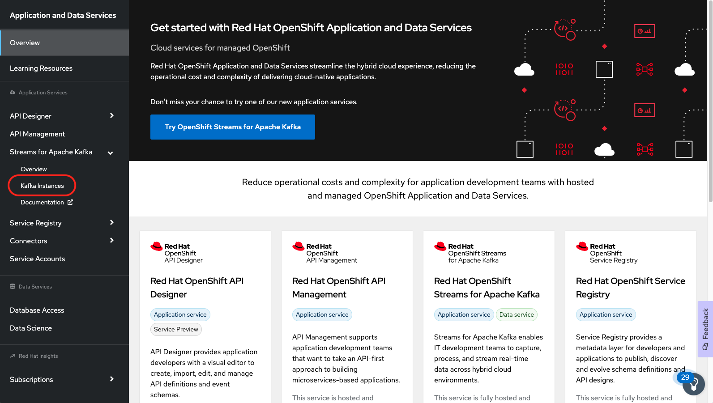

## Kafka との連携
---

### 1. 目的

Kamelet の Kafka Sink, Kafka Source を使用して、Camel K と Kafka との連携の方法について理解していただきます。

* [Kafka Sink](https://camel.apache.org/camel-kamelets/0.9.x/kafka-sink.html)
* [Kafka Source](https://camel.apache.org/camel-kamelets/0.9.x/kafka-source.html)

### 2. Red Hat OpenShift Streams for Apache Kafka　(RHOSAK) の準備

このワークショップでは、Red Hat が提供するマネージド kafka の　サービスである、Red Hat OpenShift Streams for Apache Kafka (略してRHOSAK) を使用していきます。
RHOSAK を使用すると、Kafkaの環境を自分で構築・運用することなく、ストリーム処理のアプリケーションの開発やリリースを簡単に行うことができるようになります。
なお、2023年1月現在、RHOSAKは48時間有効の、無料のトライアル版を使用することができます。

#### 2.1 RHOSAK で Kafka インスタンスをプロビジョニングする

* [console.redhat.com](https://console.redhat.com/) にアクセスし、Red Hat アカウントでログインします。

もし Red Hat アカウントを持っていない場合は、Register for a Red Hat accountリンクをクリックして、Red Hat アカウントを作成してください。
その際は、`Account Type: Personal` を選択してください。

{:width="800px"}

* ログインすると、左のメニューから、`Application and Data Services` -> `Streams for Apache Kafka` -> `Kafka Instance` を選択します。

{:width="800px"}

