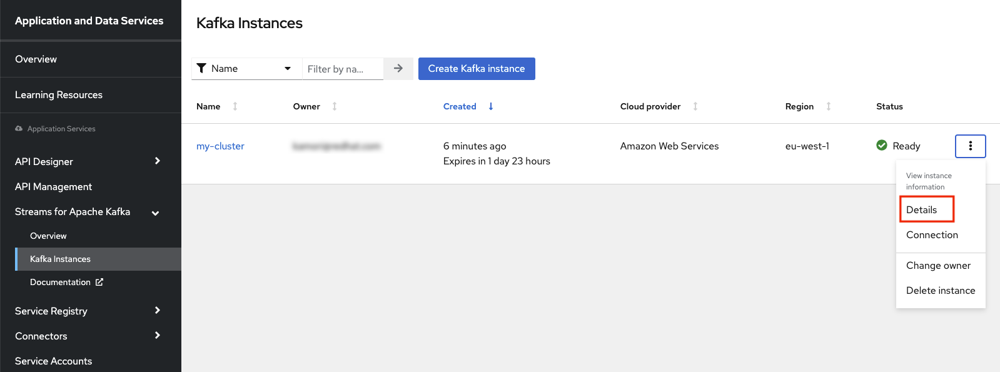
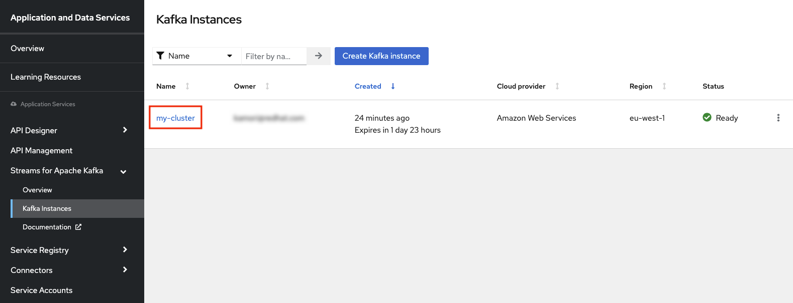

## Kafka との連携
---

### 1. 目的

Kamelet の **Kafka Sink**, **Kafka Source** を使用して、Camel K と Kafka との連携の方法について理解していただきます。

* [Kafka Sink](https://camel.apache.org/camel-kamelets/{{ KAMELETS_VERSION }}/kafka-sink.html)
* [Kafka Source](https://camel.apache.org/camel-kamelets/{{ KAMELETS_VERSION }}/kafka-source.html)

### 2. Red Hat OpenShift Streams for Apache Kafka　(RHOSAK) の準備

このワークショップでは、Red Hat が提供するマネージド kafka の　サービスである、Red Hat OpenShift Streams for Apache Kafka (略してRHOSAK) を使用していきます。
RHOSAK を使用すると、Kafkaの環境を自分で構築・運用することなく、ストリーム処理のアプリケーションの開発やリリースを簡単に行うことができるようになります。
なお、2023年1月現在、RHOSAKは48時間有効の、無料のトライアル版を使用することができます。

#### 2.1 RHOSAK で Kafka インスタンスをプロビジョニングする

[console.redhat.com](https://console.redhat.com/) にアクセスし、Red Hat アカウントでログインします。

もし Red Hat アカウントを持っていない場合は、Register for a Red Hat accountリンクをクリックして、Red Hat アカウントを作成してください。
その際は、`Account Type: Personal` を選択してください。

{:width="300px"}

ログインすると、左のメニューから、`Application and Data Services` -> `Streams for Apache Kafka` -> `Kafka Instance` を選択します。

{:width="800px"}

Kafka Instances のページで、`[Create Kafka instance]` をクリックします。

{:width="600px"}

Create a Kafka instance のページに移動するので、`Name` に任意のクラスターの名前を入力してください。

他の項目はこのままで、一番下にスクロールして `[Create instance]` をクリックします。

{:width="800px"}

作成した Kafka インスタンスがリストに表示されます。しばらくすると、インスタンスの Status が `Ready` になるので待ちましょう。

インスタンスの Status が `Ready` になったら、右側の３点のアイコンから、`Detail` を選択してください。

作成したインスタンスの詳細が表示されますので、`Connection` タブをクリックして、`Bootstrap server` の内容をメモしておきます。

#### 2.2 RHOSAK で Kafka インスタンスに接続するための Service Account を作成する

アプリケーションまたはサービスを RHOSAK の Kafka インスタンスに接続するには、Service Account を作成する必要があります。

先ほどの Kafka インスタンス詳細ページの、Bootstrap server の下に、`[Create service account]` があるので、クリックして選択してください。

任意のアカウント名を入力して、`[Create]` を選択します。

作成した Service Account の ID と Secret が表示されますので、メモをしてから閉じてください。

#### 2.3 RHOSAK で Service Account の権限を変更する

Kafka インスタンスに接続するための Service Account を作成した後、Kafka インスタンスのアクセス制御リスト (ACL) で、その Service Account に適切なアクセスレベルを設定する必要があります。

左側メニューから `Kafka Instances` を選択し、先ほど作成したインスタンスの名前をクリックします。

`Access` タブを選択し、`[Manage Access]` を選択します。

ポップアップ画面が開いたら、ドロップダウンのメニューから `All accounts` をクリックします。

次に、`Add permissions` のドロップダウンのメニューから、`Consume from a topic` を選択してください。

`Topic` と `Consumer group` の権限について、左の欄は `is`、 右の欄に `* (アスタリスク)` を入力します。 

さらに、`Add permissions` のドロップダウンのメニューから、今度は `Produce to a topic` を選択します。

`Topic` の権限について、左の欄は `is`、 右の欄に `* (アスタリスク)` を入力します。 

最後に、`[Save]` を選択してください。

これで、アプリケーションやサービスからトピックにアクセスする準備ができました。

#### 2.4 RHOSAK で Kafka トピック を作成する

Kafka インスタンスと Service Account を作成したら、Kafka トピックを作成して、アプリケーションやサービスで Kafka メッセージの取得や送信ができます。

作成した kafka インスタンス の `Topic` タブを選択し、`[Create topic]` を選択します。

ガイドの手順に従って、トピックの詳細を定義していきます。
任意のトピック名を入力し、`Next` を選択してください。

他の項目は一旦そのままで良いので、`Next` を選択し、最後に `Finish` を選択してください。
トピックの設定が完了すると、新しい Kafka トピックが一覧に表示されます。

### 3. Kafka Sink を使用して、Kafka トピックにメッセージを送信する

少し長くなりましたが、RHOSAK で Kafka を使用する準備ができましたので、まずは Kafka にメッセージを送信する処理を作成していきます。

VSCODE に戻り、左のエクスプローラー上で、右クリックをして、メニューから `Karavan: Create Integration` を選択し、任意のファイル名で空のインテグレーションを作成をしてください。
（ここでは、kafka-produce というファイル名にしておきます。）

次に `Create new route` をクリックして、Route を作成しましょう。

`components` タブから `File` を探して選択をしてください。
右上のテキストボックスに `File` と入力をすると、絞り込みができます。

{:width="600px"}

Route の source として、File コンポーネントが配置されます。
Route の File シンボルをクリックすると、右側にプロパティが表示されますので、確認してください。

Parameters は、以下を入力してください。

* **Directory Name**: data/input

> 前章の [Fileコンポーネント]({{ HOSTNAME_SUFFIX }}/workshop/camel-k/lab/file-component) で `data/input` フォルダを作成していない場合は、ワークスペースのルートフォルダ直下に、`data` フォルダを作成し、さらにdata フォルダの配下に、`input` フォルダを作成してください。

{:width="800px"}

最後に、テスト用のCSVファイルを作成します。
左のエクスプローラー上で、右クリックをして、メニューから `新しいファイル` を選択し、`kafka-test.txt` を作成します。

ファイルの中身は、`kafka sink test` としてください。

