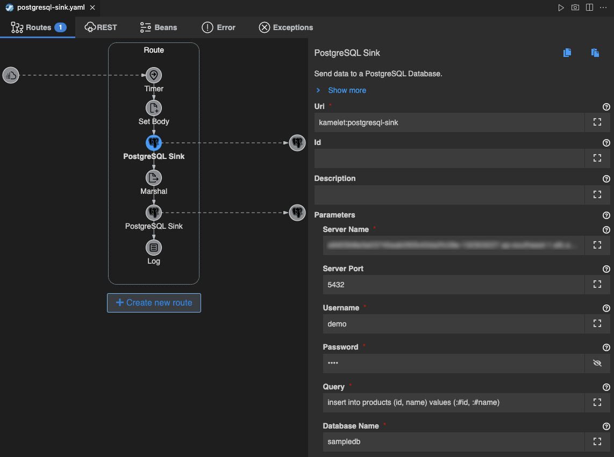

## PostgresSQL との連携
---

### 1. 目的

Kamelet の **PostgreSQL Sink** を使用して、Camel K と Kafka との連携の方法について理解していただきます。

* [PostgreSQL Sink](https://camel.apache.org/camel-kamelets/{{ KAMELETS_VERSION }}/postgresql-sink.html)

### 2. PostgreSQL Sink を使用してテーブルからデータを取得する

PostgreSQL は既に準備されているものを使うことができます。

PostgreSQL にアクセスするための情報は以下の通りです。

* **Server Name**: {{ POSTGRESQL_SERVER }}
* **Server Port**: 5432
* **User Name**: demo
* **Password**: demo
* **Database Name**: sampledb

また、データベースには products というテーブルが用意されており、以下のデータが格納されています。

|  id (integer) |  name (varchar) |
| :---: | :---: |
|  1  |  apple  |
|  2  |  orange  |
|  3  |  lemon  |

ターミナルから、下記のコマンドを実行すると、PostgreSQLにログインすることができます。

```
PGPASSWORD=demo psql -h {{ POSTGRESQL_SERVER }} -d sampledb -U demo 
```

`\d` と入力すると、テーブルの一覧が表示されます。


{:width="300px"}

products テーブル の 中身を確認してみましょう。`select * from products;` と入力してください。


{:width="300px"}

確認ができたら、`exit` を入力して PostgreSQL を終了します。

---

それでは、左のエクスプローラー上で、右クリックをして、メニューから `Karavan: Create Integration` を選択し、任意のファイル名で空のインテグレーションを作成をしてください。
（ここでは、postgresql-sink というファイル名にしておきます。）

続いて、Karavan Designer のGUIが開いたら、上部の `Create new route` をクリックして、Route を作成しましょう。

`components` タブから `Timer` を探して選択をしてください。
右上のテキストボックスに `Timer` と入力をすると、絞り込みができます。

Route の source として、Timer コンポーネントが配置されます。
Route の Timer シンボルをクリックすると、右側にプロパティが表示されますので、確認してください。

Parameters は、以下のように設定をします。

* **Timer Name**: 任意の名称
* **Repeat Count**: 1


{:width="800px"}

次に、PosgreSQL にアクセスするための Sink を追加します。
Route にマウスカーソルを持っていくと、Timer シンボルの下に小さな＋ボタンが現れますので、それをクリックし、`Kamelets` のタブから `PostgreSQL Sink` を探して選択をしてください。
右上のテキストボックスに `PostgreSQL Sink` と入力をすると、絞り込みができます。


{:width="600px"}

`PostgreSQL` のシンボルが Timer に続いて配置されます。

PostgreSQL のシンボルをクリックすると、右側にプロパティが表示されますので、
先ほどの PostgreSQL の情報を設定していきます。
Parameters 項目に、以下の内容を設定してください。

* **Server Name**: {{ POSTGRESQL_SERVER }}
* **Server Port**: 5432
* **Username**: demo
* **Password**: demo
* **Query**: select * from products
* **Database Name**: sampledb


{:width="800px"}

PostgreSQL Sink は、JSON形式のデータを Body として想定をしているため、JSON形式に変換するための Marshal が必要になります。
PostgreSQL Sink シンボルにマウスカーソルを持っていくと、左上に小さく `→` ボタンが表示されますので、クリックして、`Transformation` タブから `Marshal` を探して選択をしてください。
右上のテキストボックスに `Marshal` と入力をすると、絞り込みができます。

これで、`Timer` と `PostgreSQL Sink` の間に、`Marshal` が追加されます。

`Marshal` のシンボルをクリックすると、右側にプロパティが表示されますので、
Parameters 項目に、以下の内容を設定してください。
他の項目は、デフォルトのままで構いません。

* **Data Format**: json
* **Library**: jackson


{:width="800px"}

続いて、PostgreSQL から取得したデータを確認するための Log を追加します。
PostgreSQL Sink シンボルの下の＋ボタンをクリックし、`Routing` のタブから `Log` を探して選択をしてください。

取得した内容を表示するには、Log プロパティ の `Message` に `${body}` と入力をしてください。


{:width="800px"}

それでは、実際に動かしてみます。

右上の **▷** の実行ボタンを押してください。
（もしくは、左のエクスプローラでファイル名を右クリックして、`Karavan: Run File` を選択してください）

ターミナルが開き、作成したインテグレーションが JBang を通して実行されます。
特にエラーなく実行されたら、ターミナルに以下の Log が表示されているはずです。


{:width="800px"}

Log の確認ができたら、処理を停止してください。

### 3. PostgreSQL Sink を使用してテーブルにデータを追加する

先ほどは PosgreSQL Sink でデータを取得しましたが、今度はテーブルにレコードの追加を行う処理を作っていきます。
Karavan Designer で先ほどのインテグイレーションを開いてください。

まず、Set Body でテーブルに追加する内容を設定します。

Marshal シンボルにマウスカーソルを持っていくと、左上に小さく `→` ボタンが表示されますので、クリックして、`Transformation` タブから `Set Body` を探して選択をしてください。
右上のテキストボックスに `Set Body` と入力をすると、絞り込みができます。


{:width="600px"}

これで、`Timer` と `Marshal` の間に、`Set Body` が追加されます。

`Set Body` のシンボルをクリックすると、右側にプロパティが表示されますので、
Parameters 項目に、以下の内容を設定してください。
他の項目は、デフォルトのままで構いません。

* **Language**: simple
* **Expression**: {"id":4, "name": "melon"}


{:width="800px"}

次に、Set Body で設定した内容を PostgreSQL の products テーブルに追加してみましょう。
Marshal シンボルにマウスカーソルを持っていくと、左上に小さく `→` ボタンが表示されますので、クリックして、`Kamelets` のタブから `PostgreSQL Sink` を探して選択をしてください。
右上のテキストボックスに `PostgreSQL Sink` と入力をすると、絞り込みができます。

`PostgreSQL` のシンボルが Set Body に続いて配置されます。

PostgreSQL のシンボルをクリックすると、右側にプロパティが表示されますので、
Parameters 項目に、以下の内容を設定してください。

* **Server Name**: {{ POSTGRESQL_SERVER }}
* **Server Port**: 5432
* **Username**: demo
* **Password**: demo
* **Query**: insert into products (id, name) values (:#id, :#name)
* **Database Name**: sampledb


{:width="800px"}

それでは、実際に動かしてみます。

右上の **▷** の実行ボタンを押してください。
（もしくは、左のエクスプローラでファイル名を右クリックして、`Karavan: Run File` を選択してください）

ターミナルが開き、作成したインテグレーションが JBang を通して実行されます。
特にエラーなく実行されたら、ターミナルに以下の Log が表示されているはずです。


{:width="800px"}

Set Body で設定した情報が追加されて、取得してきたデータにも反映されています。
Log の確認ができたら、処理を停止してください。

実際に、PostgreSQL にアクセスして確認をしてみましょう。
ターミナルから以下のコマンドを実行して、PostgreSQL にログインをしてみてください。

```
PGPASSWORD=demo psql -h {{ POSTGRESQL_SERVER }} -d sampledb -U demo 
```

products テーブル の 中身を確認してみましょう。`select * from products;` と入力してください。


{:width="300px"}

確認ができたら、`exit` を入力して PostgreSQL を終了します。

---
### 参考リンク

* [Red Hat Integration - Kamelets リファレンス](https://access.redhat.com/documentation/ja-jp/red_hat_integration/2022.q4/html/kamelets_reference/postgres-sql-sink)