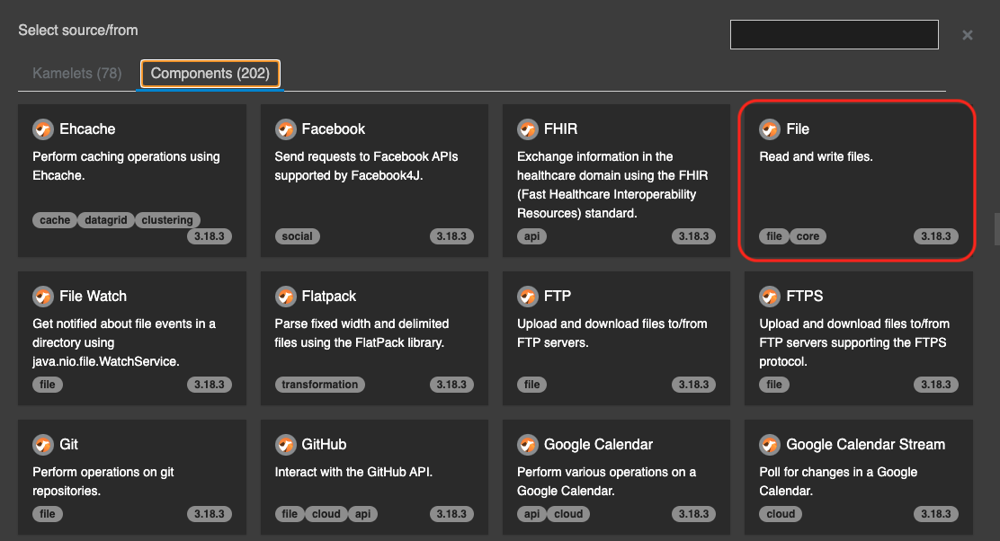
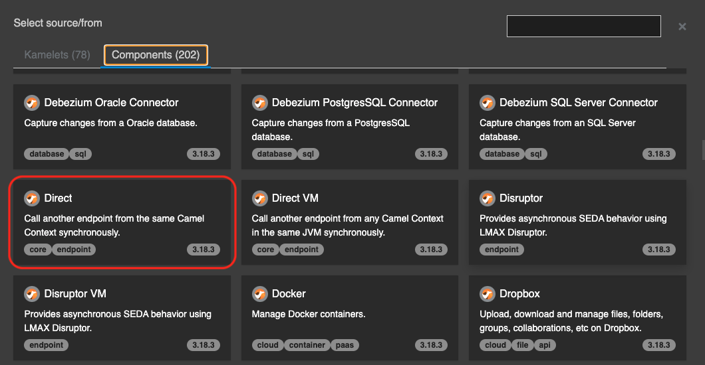
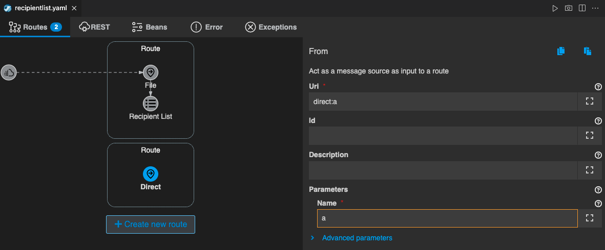

## Recipient List パターン
---

### 1. 目的

[RecipientList](https://camel.apache.org/components/{{ CAMEL_VERSION }}/eips/recipientList-eip.html) を使用して、Camel K で Route を動的に指定して分岐する方法を理解することを目的とします。

### 2. Recipient　List を使用して Route を動的に指定する

左のエクスプローラー上で、右クリックをして、メニューから `Karavan: Create Integration` を選択し、任意のファイル名で空のインテグレーションを作成をしてください。
（ここでは、recipientlist というファイル名にしておきます。）

続いて、Karavan Designer のGUIが開いたら、上部の `Create new route` をクリックして、Route を作成しましょう。

`components` タブから `File` を探して選択をしてください。
右上のテキストボックスに `File` と入力をすると、絞り込みができます。


{:width="600px"}

Route の source として、File コンポーネントが配置されます。
Route の File シンボルをクリックすると、右側にプロパティが表示されますので、確認してください。

Parameters は、以下を入力してください。

* **Directory Name**: data/input

> [Fileコンポーネント]({{ HOSTNAME_SUFFIX }}/workshop/camel-k/lab/file-component) の章で `data/input` フォルダを作成していない場合は、ワークスペースのルートフォルダ直下に、`data` フォルダを作成し、さらにdata フォルダの配下に、`input` フォルダを作成してください。

次に、別の Route を動的に呼び出しをするための Recipient List を追加します。
Route にマウスカーソルを持っていくと、File シンボルの下に小さな＋ボタンが現れますので、それをクリックし、`Routing` のタブから `Recipient List` を探して選択をしてください。


{:width="800px"}

`Recipient List` のシンボルが File に続いて配置されます。
Recipient List シンボルをクリックすると、右側にプロパティが表示されますので、確認してください。

Parameters は、以下のように設定をします。
他の項目は、デフォルトのままで構いません。

* **Language**: simple
* **Expression**: ${bodyAs(String)}
* **Delimiter**: ; (セミコロン)


{:width="800px"}

次に、分岐先の Route を定義していきます。

`+ Create new route` をクリックしてください。
source は、`components` タブから `Direct` を探して選択をしてください。
右上のテキストボックスに `Direct` と入力をすると、絞り込みができます。


{:width="600px"}

新しい Route が作成されますので、source の `Direct` シンボルをクリックして、右側のプロパティを確認します。

Parameters は、以下のように設定をします。
他の項目は、デフォルトのままで構いません。

* **Name**: a


{:width="800px"}

また作成した Route の上部の Route名をクリックして、右側の Description に `direct:a` と入力してください。


{:width="800px"}

それでは、direct:a の Route が呼び出されかどうかを確認するための Log を出力しておきます。

Direct シンボルの下に小さな＋ボタンが現れますので、それをクリックし、`Routing` のタブから `Log` を探して選択をしてください。

Log の Messege は、`direct:a invoked` と入力をしておきます。


{:width="800px"}

同様にして、`+ Create new route` をクリックし、`drect:b`、`direct:c` の Route を作成します。
Log を表示するのも忘れずに追加してください。


{:width="800px"}

最後に、テスト用のテキストファイルを作成します。
左のエクスプローラー上で、右クリックをして、メニューから `新しいファイル` を選択し、`recipient.txt` を作成します。
ファイルの中身は、

```
direct:a;direct:b
```

としてください。

それでは、実際に動かしてみます。

右上の **▷** の実行ボタンを押してください。
（もしくは、左のエクスプローラでファイル名を右クリックして、`Karavan: Run File` を選択してください）

ターミナルが開き、作成したインテグレーションが JBang を通して実行されます。
特にエラーなく実行されたら、先ほど作成した `recipient.txt` を `data/input` フォルダに移動して格納をしてください。
ファイルが取得され、Route が実行されますので、ターミナルの Log を確認してください。
`direct:a invoked`、`direct:b invoked`、 の文字列が表示されていれば、OKです。 


{:width="800px"}

それでは、今度は `recipient.txt` の中身を、

```
direct:b;direct:c
```

に変更て保存し、再び `data/input` フォルダに移動して格納をしてください。
ターミナルの Log を確認すると、今後は `direct:b invoked`、`direct:c invoked`、 の文字列が表示されているはずです。 


{:width="800px"}

確認後、`Ctrl+C` もしくは、ターミナル右上のゴミ箱のアイコンをクリックして、終了してください。