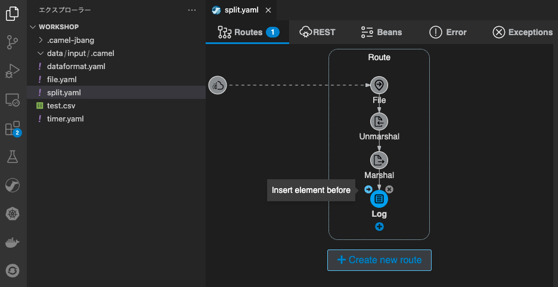

## Split パターン
---

### 1. 目的

[Split](https://camel.apache.org/components/{{ CAMEL_VERSION }}/eips/split-eip.html) を使用して、Camel K で Message を分割する方法について理解します。

### 1. Message の分割

前章の [DataFormatsパターン]({{ HOSTNAME_SUFFIX }}/workshop/camel-k/lab/data-formats) で 作成したインテグレーションを使用します。
まだ前章を実施していない場合は、先にそちらを実施して下さい。

前章で作成した、インテグレーションファイルをコピーし、任意の別の名前に変更をしてください。
（ここでは、split というファイル名にしておきます。）

左のエクスプローラー上で、`split.yaml` 右クリックをして、メニューから `Karavan: Open` を選択し、Karavan Designer のGUIを開きます。

JSON形式のデータを、分割する処理を追加します。
Log シンボルにマウスカーソルを持っていくと、左上に小さく `→` ボタンが表示されますので、クリックします。

{:width="800px"}

続いて、`Routing` タブから `Split` を探して選択をしてください。
右上のテキストボックスに `Split` と入力をすると、絞り込みができます。

{:width="600px"}

`Split` のシンボルをクリックすると、右側にプロパティが表示されますので、
Parameters 項目に、以下の内容を設定してください。他の項目は、デフォルトのままで構いません。

* **Language**: jsonpath
* **Expression**: $

{:width="800px"}

次に、`Log` 処理を `Split` で分割した直後のステップに移動します。

`Log` シンボルを左クリックでドラッグし、`Split` シンボルの上にドラッグしてください。

ポップアップ画面が表示されますので、`Move as target step` を選択してください。

{:width="800px"}

これで、`Split` で分割した後のMessageの内容が表示されます。

{:width="800px"}

それでは、右上の **▷** の実行ボタンを押してください。
（もしくは、左のエクスプローラでファイル名を右クリックして、`Karavan: Run File` を選択してください）

ターミナルが開き、作成したインテグレーションが JBang を通して実行されます。
特にエラーなく実行されたら、[前章]({{ HOSTNAME_SUFFIX }}/workshop/camel-k/lab/data-formats)で作成した、 `test.csv` を `data/input` フォルダに移動して格納をしてください。

ターミナルに以下のような Log が表示されます。

{:width="800px"}

JSON形式のデータが分割されて、分割された処理毎に Log が出力されることが確認できます。

Log の確認ができたら、処理を停止してください。

### 3. Parallel Processing

次に、処理を停止した後、`Split` シンボルをクリックし、右側のプロパティから `Parallel Processing` を探してスイッチをオンにします。

{:width="800px"}

それでは、再び右上の **▷** の実行ボタンを押してください。
（もしくは、左のエクスプローラでファイル名を右クリックして、`Karavan: Run File` を選択してください）

ターミナルが開き、作成したインテグレーションが JBang を通して実行されます。
特にエラーなく実行されたら、もう一度[前章]({{ HOSTNAME_SUFFIX }}/workshop/camel-k/lab/data-formats)で作成した、 `test.csv` を `data/input` フォルダに移動して格納をしてください。

ターミナルに以下のような Log が表示されます。分割されたデータの Log の表示が順不同になり、
赤枠で囲った部分を見ると、スレッドIDがそれぞれ異なっていることが確認できます。
（もし表示順が同じだった場合は、何度かやり直してみてください）

{:width="800px"}

Log の確認ができたら、処理を停止してください。