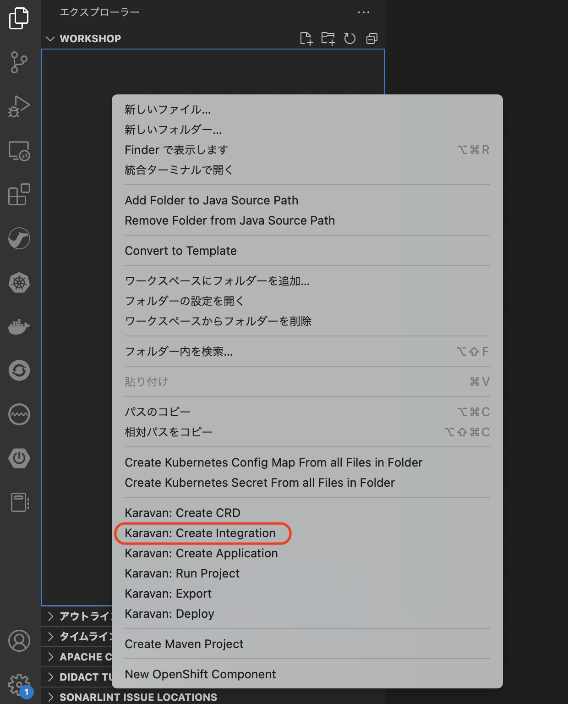

# Timer コンポーネント
---

## 1. 目的

[Timer](https://camel.apache.org/components/3.18.x/timer-component.html) コンポーネントの内容を理解するとともに、Karavan Designer を使用した Camel K インテグレーション実装のイメージを把握することを目的とします。

## 2. Camel K インテグレーションの作成

まず、任意のフォルダに VSCODE のワークスペースを作成します。
左のエクスプローラー上で、右クリックをして、メニューから `Karavan: Create Integration` を選択してください。

{:width="200px"}

image::create_project.png[create_dialog, 700]