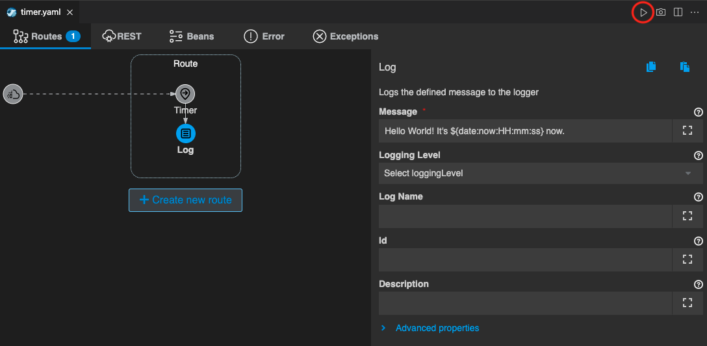
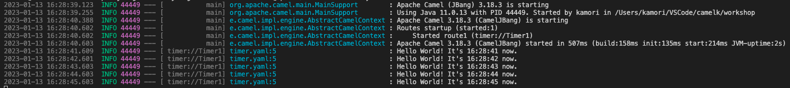

## Timer コンポーネント
---

### 1. 目的

[Timer](https://camel.apache.org/components/{{ CAMEL_VERSION }}/timer-component.html) コンポーネントの内容を理解するとともに、Karavan Designer を使用した Camel K インテグレーション実装のイメージを把握することを目的とします。

### 2. Hello World の作成

まず、任意のフォルダに VSCODE のワークスペースを作成します。

左のエクスプローラー上で、右クリックをして、メニューから `Karavan: Create Integration` を選択してください。


{:width="600px"}

次に、中央上部にファイル名を入力するポップアップが表示されますので、適当に入力して `Enter` を押してください。
（ここでは、timer というファイル名にしておきます。）


{:width="600px"}

`timer.yaml` が作成されて、Karavan Designer のGUIが開きます。

上部の `Create new route` をクリックして、Route を作成しましょう。


{:width="800px"}

`source` を選択する画面が開きますので、その中の `components` タブから `Timer` を探して選択をしてください。
右上のテキストボックスに `Timer` と入力をすると、絞り込みができます。


{:width="600px"}

Route の source として、Timer コンポーネントが配置されます。
Route の Timer シンボルをクリックすると、右側にプロパティが表示されますので、確認してください。


{:width="600px"}

 <span style="color: red">赤い * (アスタリスク)</span>　が付いている項目は、入力が必須です。

Parameters 項目に、以下の内容を設定してください。

 * **Timer Name**: Timer1
 * **Delay**: 1000 (初回実行までのディレイ、単位はms)
 * **Period**: 1000 (繰り返し実行の周期、単位はms)
 * **Repeart Count** : 5 (繰り返しの回数、0の場合は実行し続けます)

次に、Route にマウスカーソルを持っていくと、Timer シンボルの下に小さな＋ボタンが現れますので、それをクリックしてください。


{:width="800px"}

Timer に続く Step を定義することができます。
ここでは、コンソールに `Hello World` の Log を表示させてみます。

`Routing` のタブから `Log` を探してクリックをしてください。


{:width="800px"}

`Log` のシンボルが Timer に続いて配置されます。

Log プロパティ の `Message` に 

```
Hello World! It's ${date:now:HH:mm:ss} now.
```

と入力をしてください。`${date:now:HH:mm:ss}` は、現在の時刻を HH:mm:ss の形式で表示します。

それでは、実際に動かしてみます。
右上の **▷** の実行ボタンを押してください。
（もしくは、左のエクスプローラでファイル名を右クリックして、`Karavan: Run File` を選択してください）


{:width="800px"}

ターミナルが開き、作成したインテグレーションが JBang を通して実行されます。
Hello World の文字列が、約1秒間隔に5回表示されることを確認してください。


{:width="800px"}

確認後、`Ctrl+C` もしくは、ターミナル右上のゴミ箱のアイコンをクリックして、終了してください。

---

#### Window 環境で実行の場合

以下のようなエラーが出ることがあります。

><pre>
> [jbang][ERROR] Script or alias could not be found or read: '.jbang.version=3.18.3'
>[jbang] Run with --verbose for more details
></pre>

その場合は、ターミナルから、以下のコマンドを実行してみてください。

><pre>
> > jbang "-Dcamel.jbang.version=3.18.3" camel@apache/camel run timer.yaml
></pre>

*`"-Dcamel.jbang.version=3.18.3"`* のように、ダブルクォーテーションを使う必要があります。

---

###　参考リンク

* [Red Hat Integration - Kamelets リファレンス](https://access.redhat.com/documentation/ja-jp/red_hat_integration/2022.q4/html/kamelets_reference/postgres-sql-sink)