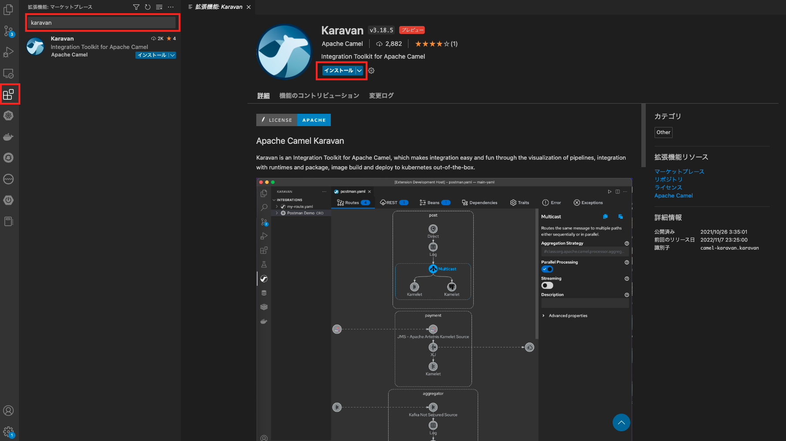
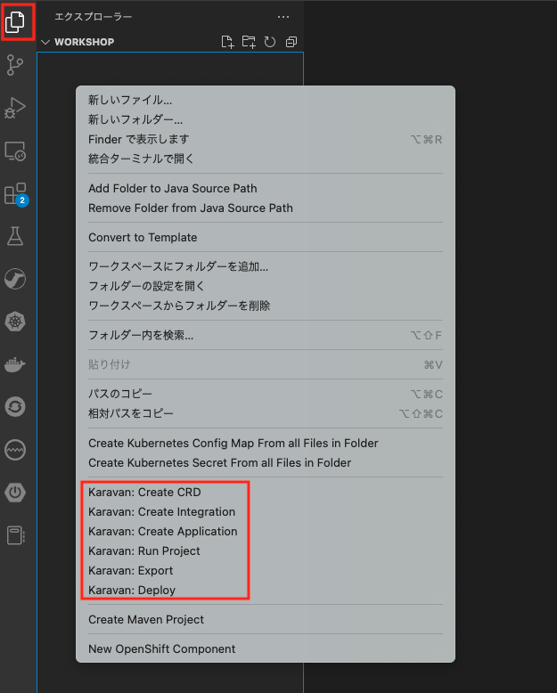

## 利用環境 について
---

### 事前準備

このワークショップでは、ローカル環境で 簡単な Camel K インテグレーションを作成し、動作を確認すると共に、Karavan Designer を使用した 実装のイメージを把握していただきます。

事前準備として、下記をローカル環境にインストールしてください。

* VSCODE
* Karavan Designer (VSCODE の拡張機能)
* JBang

### VSCODE

[VSCode](https://code.visualstudio.com/)とは、正式にはVisual Studio Codeといい、Microsoft社の提供する無償のコードエディタです。
このVSCODEには、「拡張機能」によりさまざまな機能を追加することができます。

今回、Camel K の設計を行うGUIツールは、VSCODEの「拡張機能」として、コミュニティから提供をされているものになります。

VSCODE のダウンロードについては 下記の URL へアクセスをして、右上の `Download` のリンクをクリックして、対応するOSを選択して実施をしてください。
（ここでは、インストールの詳細については割愛します）

* [https://code.visualstudio.com/](https://code.visualstudio.com/)

### Karavan Designer

[Karavan](https://github.com/apache/camel-karavan) は、Apache Camel 用の開発ツールキットです。ランタイムおよびパッケージとの統合や、イメージのビルド、kubernetesへのデプロイが可能な他、Camel K の Yaml DSL をグラフィカルに作成することができます。


{:width="800px"}

karavan のインストールについては、VSCODEのエディタを通して行います。
ローカル環境上で、VSCODEのワークスペースのルートフォルダを作成し、VSCODEを開いてください。
ターミナルから、作成したフォルダに入り、

```
code .
```

と入力するとエディタが開きます。

左端の拡張機能のメニューを選択し、拡張機能検索のテキストボックスに `karavan` と入力してください。Karavan が表示されたら、インストールを選択します。


{:width="800px"}

左端のメニューの一番上のエクスプローラをクリックし、エクスプローラ上で右クリックをして、karavan のメニューが表示される様になればOKです。


{:width="600px"}


### JBang

[JBang](https://www.jbang.dev/)は、Javaをスクリプトのように実行できるツールです。日本での知名度はまだまだ低いですが、Quarkusのエンジニアが開発していることもあり。モダンなJava開発環境との連携が充実しています。

今回のワークショップでは、karavan Designer で作成した Camel K インテグレーションを、JBang を通して実行し、動作を確認していきます。

JBang のインストールについては、下記のリンクを参考にしてください。
（ここでは、インストールの詳細については割愛します）

* [https://www.jbang.dev/documentation/guide/latest/installation.html](https://www.jbang.dev/documentation/guide/latest/installation.html)